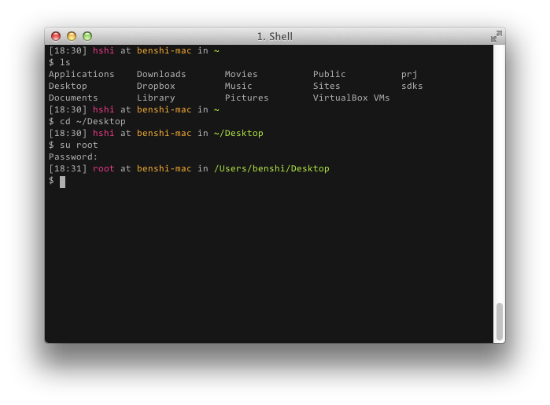

I use the terminal a lot and quiet often enough I felt that it did not give me enough information on where I am or which shell I am in or even which user I am. So I went ahead and changed my shell prompt to give it a bit more information, at the same time highlighting important bit of information.



You can temporarily test it out by executing the following command in shell, but you'll lose this once you close and open a new session. Alternatively, if you want to keep the change you can simply add this to your '.bashrc' file.

```bash
export PS1="[\A] \e[0;31m\u\e[m at \e[0;33m\h\e[m in \e[0;32m\W\n\e[m\$ "
```

Lets dive into the syntax a little shall we.

- **\A** : the current time in 24-hour HH:MM format
- **\e[n;yym** : start of the color tag where 'n;yy' is the color of the string within the opening and closing tag
- **\e[m** : end of the color tag
- **\u** : username of current user
- **\h** : host name
- **\W** : absolute path of your current location
- **\n** : new line

There are other syntax available but I feel these ones are suffice to meet my needs.
