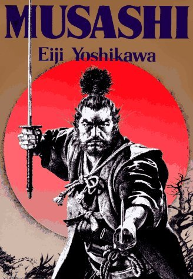

This masterpiece by Eiji Yoshikawa is easily one of the best (if not the best) book I have ever read. A well-written fictionalisation of the intriguing life of one of the world's greatest swordsman of all time, [Miyamoto Musashi][1]. Now the book itself is BIG, 970 pages to be exact. At this point I should probably point out: 1) It's my first review and 2) I'm pretty bad with my readings, and it took me a good 4 months to finish this book.

This book opens with Musashi escaping from the [Battle of Sekigahara][2] as a fugitive and continues with his transformation from a brute and self-centered person to a hero of great character and wisdom. The book itself revolves around the themes of love, rivalry, misguided revenge and Musashi's dedication to the way of the samurai and lifelong learning. Musashi's life was captured by Yoshikawa accurately and presented elegantly in writing. The attention to the Japanese history/culture, character relationships and social hierarchy was covered in great detail.

For me, each character from this book has taught me something valuable, whether it be thinking critically, training, persistence, tactics and trust. I would highly recommend it to anyone whether you are reading it for the historical significance, martial arts, Japanese culture, heroics or portrayal of human transcendence, you will not be disappointed and hopefully you would have received some of the learnings I got!

[1]: https://en.wikipedia.org/wiki/Miyamoto_Musashi
[2]: https://en.wikipedia.org/wiki/Battle_of_Sekigahara
