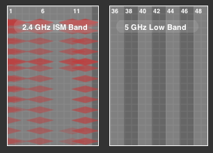

I have this annoying problems where I couldn't set my wifi channel to anything apart from 1, 6 and 11. If I set it to anything except the three channels mentioned none of my device is able to connect to it. Both my MBP and iPhone 4 prompted my for my WPA2 pre-shared keys but would complain about a connection timeout, while my android phone and tablet just wouldn't connect at all.

It turned out the problem originated from my wireless router (Billion 7800N). The specific parameter which was causing all these problem was the **channel width** which was set to "20/40 MHz". I was able to fix it by setting it to just "20 MHz".

Channel width specifies how big or how much of the spectrum a channel is able to use to transmit data between wireless devices. The larger the channel width, the more prone it is to interference from other wireless devices. The reason for this is very simple, a wider channel width would mean that the channel will overlap with other channels which means the same spectrum maybe potentially be shared by more devices (i.e. Cordless Phones which also commonly uses the 2.4 Ghz spectrum, with channel width about 5 - 10 Mhz or Bluetooth devices). Typically 20 MHz channel width are used on 2.4 GHz wireless routers while using 40 MHz would most likely give you a higher throughput, but at the cost of reliability and stability due to interference.

My ICT knowledge finally coming into handy. 😉
