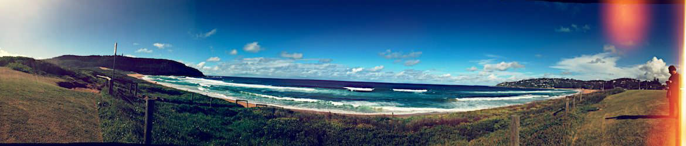
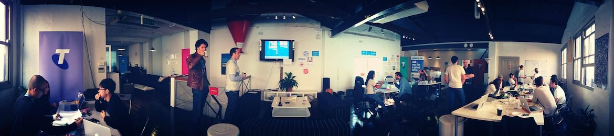

Checking in for first half of 2013.

**I started at my new job**

Starting at a new job has also being something daunting for me especially when I have worked in a completely different environment for the past 3 years. Readjusting has been a bit of a rollercoaster ride, some days I feel great and some days I feel completely clueless but this is all part of the learning experience. In the 4 months, I have learnt about the business, the people and the culture. The work condition is what you would expect in a place like a global investment firm, so I would not bother explaining that. There are a lot of social clubs within the firm that are freely available to all the employees and they hold events very frequently (I am always in it for the food).

I also have a technology bootcamp in London coming up later this year. I do not exactly know what to expect from this trip since it will be my first time visiting Europe. I know one thing for sure though! That is I'm going to be bringing my camera and do a lot of touristy things.

**I started caring about my health**

Ever since start of uni, my fitness has dropped and I gained quite a few circles around my waist. I am in the process of getting rid of my bad habit of skipping breakfast and made it my goal to have breakfast every day. I am also getting into the rhythm of heading to the gym at least twice a week.

Boy, I really need change my sleeping patterns but I will start with fitness and eating healthy. Baby steps right?

**I started networking more**

My new job has given me the opportunity to meeting a lot more people, this also has allowed me to both form new circles and extend my existing ones. I caught up with my former colleagues over lunch a couple times already this year and not "burning bridges" is something I'm trying very hard to avoid. I am slowly working through my list to catch up with friends but time is hard to come by.

**I started giving back to loved ones**

This has been something I wanted to do for a long time but never have the time nor the opportunity to execute it. Until now. Last month I invited my dad and my grandmother over from China for a short holiday, they have never left China before and being able to visit Australia is definitely something on their bucket list. I took some times off from work and showed them around the state and also got them on a trip to Cairns (even I have not been to Cairns myself)!

**I started participating in philanthropy work**

Normal fund raisers and charity events just doesn't cut it for me so I decided that I want to use my skills for social good. I am currently participating in Aspirations program mentoring high school students, helping them to get exposure to the modern workforce and build their confidences before completing their HSC. Another event was through work where we are helping out United Way of Australia and their ReadLearnSucceed program. I am creating a great dashboard to track their programs progress in difference communities.

And finally something I am very proud of is participating in a Charity hackathon. My team and I represented the RSL to build a mobile app that aims at raising awareness and drive donation to the ANZAC cause. The final product came out suprisingly well and we ended up taking [first place][1]! Go Team Poppy!

I think 2013 has been great already and the rest of 2013 is only going to go uphill from here. This is all I have for now. See ya at the next checkpoint!

[1]: https://www.telstracrowdsupport.com/t5/SYDNEY-APPINESS-HACKATHON/Sydney-Hackathon-Winners-announced/ba-p/161076
