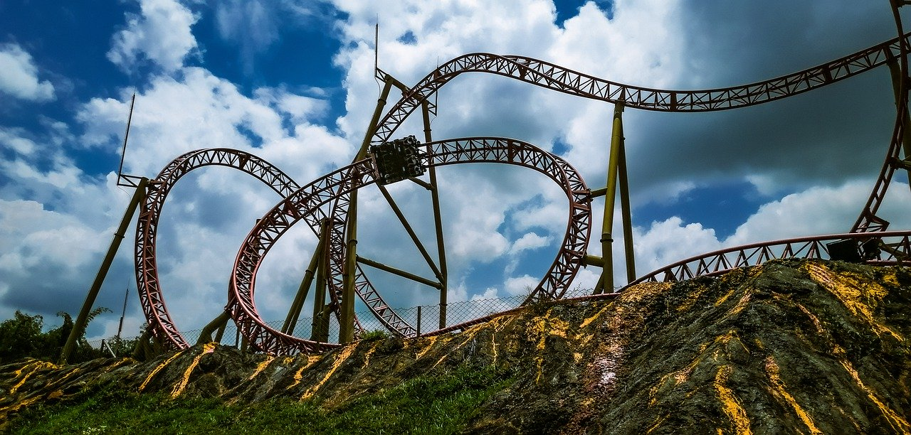

Where do I even begin? 2020 is turning out to be one of the strangest I
have ever experienced. I'm sure I'm not alone in thinking this as we all
have been affected in one way or another by
[COVID-19](https://www.worldometers.info/coronavirus/). The invisible
virus wreaked havoc throughout the world, many people have lost loved
ones, we were forced to stay within the bounds of our four walls, the
economy has also taken a huge hit and like many, I lost my job in the
midst of it all.

Before I start talking about where I am now in this roller coaster,
let's unwind...

 *2020 a roller coaster
(caruizp - pixabay)*

### The Sea Change

Since late 2017, I've been consulting with an AWS partner helping
businesses transform their IT operations and assist them with their
journey into the cloud. During this time I had the privilege to work
across industries from financial services, governments to airlines. I
lead those projects responsible for the design and implementation of
APIs and microservices. I have had my fair shares of WTF moments while
working in consulting but that's a story for another time.

After a fair amount of project work and reinventing the wheel if you
will, the speed at which I personally operated has started to wear on
me. While the hours I worked were pretty normal, but the stress to
deliver and keeping the clients happy were getting to me. The onboarding
process, getting to know new people (not only within the consulting
company but also clients), understanding how they operate and their
skills all took significant effort. So imagining repeating this process
every 3-6 months as you start/finish the projects and moving on to
another.

I made an internal move to the product team towards the end of my tenure
to help build out a plug-n-play identity and access management system.
The team and the tech stack used on the project were top-notch. I was
not on client site anymore and rather than reinventing the wheel, we are
making the wheel better, faster and strong. All perks of working on a
product team.

Around August of 2019, I found out a close friend of mine joined a new
company and they have an open position for an Engineering Manager role.
At the time I didn't want to move off the tools and move into management
just yet. But after some careful consideration, I decided to have a chat
and find out more about the opportunity (never turn down an
opportunity). I didn't know what I was expecting, after all, I have
never sat in an engineering manager interview previously, all I had was
my prior experiences of leading engineering teams and consulting. To my
surprise, the chat went super smoothly and I got offered the position on
the spot.

### That didn't last...

A month later I found myself in unfamiliar territory as an Engineering
Manager of a fintech startup (it still sounds a little funny when I say
it out loud and introduce myself). At the time we had about 12 engineers
and more than half of them only started within the last 6 months. I
guess you can say the company was in a hyper-growth stage.

I hit the ground running immediately and applied a lot of what I have
learnt in the past. I also picked up precious knowledge on managing
software teams and scaling (future posts). Everything was going along
fine, the team grew to close to 20 people and I was starting to find my
rhythm until...COVID-19.

On 25th March, I received the unfortunate news along with the rest of
the company that everyone's role has been made redundant. I still
remember this day vividly and I'm sure everyone there would as well. The
news was delivered to the entire company via Zoom, since only a week
prior, we were all asked to work from home due to the strict lockdown
laws.

I was shocked. Although I found out about the news earlier than the rest
of the company, it didn't make the news any less shocking. The worst
part is watching people's reaction over a computer screen. There were
lots of supportive messages for the CEO and the company at the
announcement. As they try to seek additional funding to bring the
company back from suspended animation. Like anyone who has been told
their job is no longer available, I updated my resume and decided to put
myself on the job market again.

### Or did it?

I was SUPER conflicted. I had an important decision to make, whether I
continue down the managerial route or if I should get back on the tools.
The different paths would have a different lead-time, preparation and
steer my career in the opposite direction.

The job market was dead slow at the start of April and there were a lot
of companies going through the same fate as mine. Companies hiring were
forced to tighten spend and freeze unnecessary hires. It has picked up
since then as companies start to accept the status quo and begin to live
with the fact that COVID-19 is here to stay.

Around mid-April, the Australian Government announced the
[JobKeeper](https://www.business.gov.au/Risk-management/Emergency-management/Coronavirus-information-and-support-for-business/JobKeeper-Payment-for-employers-and-employees)
program, its aimed at helping employees stay in jobs and take the burden
off Australia's welfare system. As a result of this, some of us were
asked to come back on a part-time basis to keep the ship going while the
founders try to secure the funding. This made my decisions a lot easier
and I was not forced to make a career decision out of my hand.

While the development team is a lot smaller now and things are still not
back to normal for a lot of us. I am getting a lot more positive about
the situation as I continue to receive news of people who are no longer
with the company locking in full-time employment or other forms of
freelance work.

Working part-time also meant that I have got a lot of free time on my
hands. I find myself reading and coding a lot more. I am waiting for the
lockdown to ease further. When that happens, I'm sure everyone will meet
up and catch-up on everything over a beer or two in a pub.

So that's where I am now, I'm optimistic the world will start to recover
and everything will hopefully get back to normal by the end of the year.
