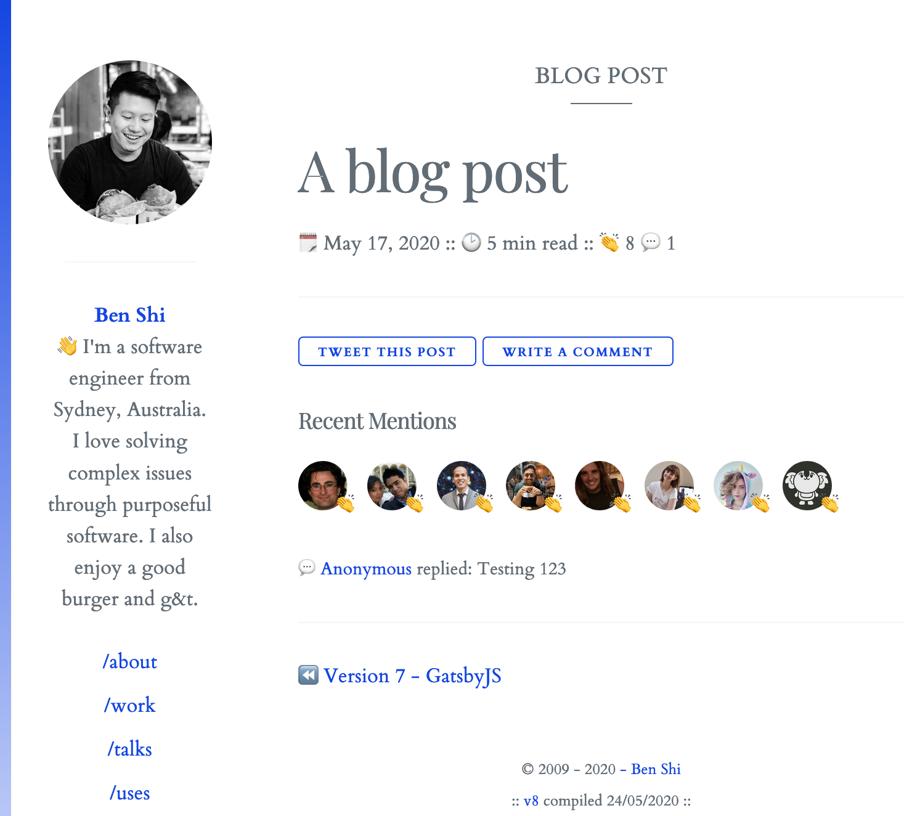

I've been looking for the perfect commenting solution for my blog in the
last few weeks. After trialing various solutions to no avail, I stumbled
into the world of IndieWeb and in particular Webmention. This is a two
part series, in the first I will go in to some details on what
webmention is, how it works and what some benefits you may get over and
above existing solutions. In the second I will go into how I went about
implementing it.

### Why existing solutions didn't work?

First, I want to talk about how existing solutions like
[disqus](https://disqus.com/),
[isso](https://posativ.org/isso/),
[utterance](https://utteranc.es/),
[commento](https://commento.io/) and many others didn't quite fit what I
needed.

#### 1. Privacy

One of the most popular commenting solution out there is Disqus and it
is usually the first solution people recommend due to how complete it
is. But then how can disqus provide such a service and all of its
features for free? There is a famous saying "if you're not paying for
the product, you are the product", this holds true there. While Disqus
do have a paid tier, their revenue model is predominately ads and
analytics. So would be a no from me, as I wanted to respect the privacy
of all visitors on my website, the same reason why you won't find Google
Analytics on my website.

#### 2. Entry Barrier for Interacting

Many solutions require the reader to sign in before interacting such as
a medium account before giving a clap to a medium article. Solutions
like staticman and utterance require a github account for users to leave
a comment. These "barriers" creates friction and its not something I
want for a niche blog like mine. Social login such as google, facebook
and twitter are more widely available since most people would have at
least one of the above and they are supported on many of the commenting
solutions out there. But since privacy is a concern of mine, facebook
and google logins are out. Twitter is somewhat more acceptable amongst
the tech community.

#### 3. Ease of setup

Isso and Commento are popular alternatives to Disqus, they are super
lightweight and respects your privacy and data. However they do require
manual setup and a server to run on since they are self-hosted
solutions. Since I've only just decommission all my servers, spinning up
another is not something I would like to entertain. Having said that if
you are already running your own server the two optioned mentioned here
are great options.

#### 4. Cost

Cost, it all comes down to money at the end of the day. While I would
love to pay for it and support the developers on those projects, I find
it super difficult to justify it for my low traffic personal website
whether it be hosting it on my own server or paying $5 a month for a
commenting service like commento.

#### 5. Theme

Last area of consideration is theming. I've decided to implement a theme
switcher on the website, which means the comment section needs to be
switch themes. From all of the solutions I've tested none of them
blended into my website's stylesheet natively without heavily reliant on
some javascript magic to manipulate the dom and add in the style or
classes. This is due to how majority of them injects an iframe into the
page after the page has loaded.

### Webmention

The idea haas been around for some time check out the
[W3C spec](https://www.w3.org/TR/webmention/), I personally have not
heard of it until I eventually stumbled upon webmention from
[swyx](https://www.swyx.io/writing/clientside-webmentions/) and
subsequently
[Max Bock](https://mxb.dev/blog/using-webmentions-on-static-sites/).
Their implementations really grabbed my attention so I decided to dive
further.

Let's start with a little overview webmention, directly from the
[IndieWeb wiki](https://indieweb.org/webmention).

> Webmention is a web standard for mentions and conversations across the
> web, a powerful building block that is used for a growing federated
> network of comments, likes, reposts, and other rich interactions
> across the decentralized social web.

This means, no single service owns the data and your interactions are
stored on various services waiting to be aggregated such as twitter,
mastodon and any other blogs/websites. If you are reading this article
then you may have noticed my webmention implementation already, if not
then here is a screenshot of it in action!

 *webmention on hbish.com*

For my website, I have "claps" which gets fetched directly from twitter.
Any tweets with my blog links on it that receives likes will show up
here because my website implements webmention protocol.

The recent mentions section shows who has liked the post and comments.
Because of the federated nature of webmention, comments can also come
from multiple sources. In my case, "mentions" are a combination of
twitter replies and direct comments hosted off on another service called
[comment parade](https://commentpara.de/) which allows no signup
comments! Another benefit of webmention is that traditional pingbacks
from other websites can also be converted into webmention and displayed
as mention.

Obviously implementing it yourself takes time but you get much more
flexibility in terms of:
- source the reactions - twitter, where I spend most of my time online
- theming - my recent comments fits right into all four of my website
  theme options.
- cost - free as in beer!

### Great! How can I go about implementing it?

One thing to note before you start implementing webmention is that you
can fetch the mentions at build time or during runtime (via the client).
Both approaches have tradeoffs, it worth understanding them before
diving in the deep end and implementing your own.

If you have a high traffic website and you want the page to load quickly
then you can opt for a build-time approach. The obvious tradeoff here is
that your webmentions will only be updated whenever you publish an
update. If you want your webmentions to be updated more often, then you
would have to trigger your builds more regularly. This can be achieved
in a few different ways, either by a schedule or a webhook that triggers
a build whenever a interaction or mention is observed. Those approach
offers a good trade off between performance and freshness of your
webmention.

The other approach is to fetch the webmentions at run-time on the
client. This adds additional overhead to your website, as it needs to
make more http calls. What you do get with the additional performance
hit is that your website's mentions will always receive the latest
interactions. This may be acceptable on a lower traffic websites like
mine.

So hopefully by now, you have a good understanding of webmention and
some of the advantages it brings. In part 2, I will be going through how
I have implemented webmention, along with lots of resources so you can
get started too! Stay Tuned (I promise it won't be a 2 year wait like my
Gatsby post).
