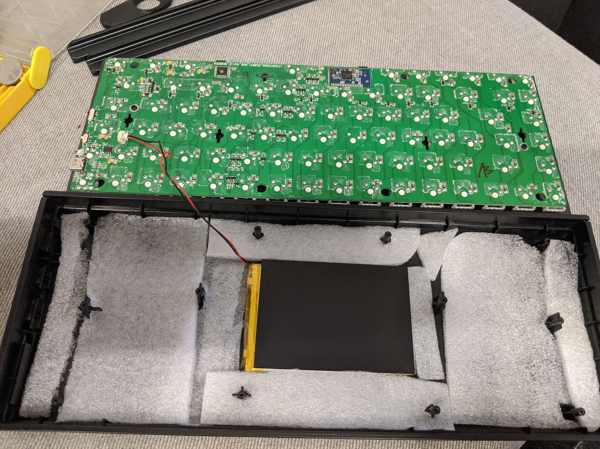

If you are mechanical keyboard user and have been on my
[/uses](https://hbish.com/uses/) page you may have noticed I use
[Keychron K2](https://www.keychron.com/products/keychron-k2-wireless-mechanical-keyboard)
keyboard as my daily driver.

The K2 is a feature packed entry level mechanical keyboard that I
personally rate very highly. The K2 have done a lot right, especially
with the minimalist look, battery and the bluetooth connectivity. The
build quality is fairly decent for its price and the gateron switch for
me felt smoother that the cherry switch on my other mechanical
keyboards.

There are really 2 complaints I have with the KeyChron K2:

1. The height - it is a tall keyboard, so your wrist may feel
   uncomfortable through prolonged use. However can easily be remediated
   with a palm rest, so not a big deal.
2. Typing sound - while the switch is smooth to type on, the keypress
   itself sounds hollow and plasticky. Damn, not a easy fix.

After 12 months of solid use and out of warranty, I decided to have a go
at modding the K2 to see if I can make it sound better. I have recorded
a before and after sound test so you can hear a comparison.

Before:

<iframe width="560" height="315" src="https://www.youtube-nocookie.com/embed/cAZnXS1C3Zk" frameborder="0" allow="accelerometer; autoplay; encrypted-media; gyroscope; picture-in-picture" allowfullscreen></iframe>

After:

<iframe width="560" height="315" src="https://www.youtube-nocookie.com/embed/wMfrIxf72-M" frameborder="0" allow="accelerometer; autoplay; encrypted-media; gyroscope; picture-in-picture" allowfullscreen></iframe>

The difference is subtle but you can definitely hear some enhancements.
The sound before I did the mod sounded super empty and hollow, its
almost like two pieces of plastic tapping on each other (especially when
I press on the spacebar). The sound after I did the mod is much more
fuller and smooth, what a mechanical keyboard should sound like!

So how did I go about it? Well there really there are 3 parts, to it and
the get progressively more involved (may even void your warranty - you
have been warned).

### O-rings (took ~10 minutes)

O-rings are dampeners that you can use and fit under the keycaps. This
would make bottoming out sound a lot more softer as the o-ring prevents
the keycaps from hitting the bottom plate.

This was one of the very first things I did to the keyboard after a
couple of weeks of using it. Its a low cost solution to the problem
(less than $5 for 120) and can be achieve fairly quickly.

The downside here is you are adding another 1-2mm to the keyboard, again
not a big issue if you use a palm rest.

### Lubing the switches and stabilizers (took ~60 minutes)

Now the mod is starting to gets more technical, I would recommend you do
a bit of research before jumping in and lubing as it may damage your
switches if you don't do it properly.

Lubing is basically a process of adding lubricants on to high friction
areas of the switch to silence the switch and make it feel smoother.

There are multiple ways of lubing the switches (try youtubing them),
I've opted to go with not desoldering the keyboard because I don't have
a switch opener and I wanted to apply the lube fairly quickly. If you
have the newer version of the Keychron, I believe the switches are
actually hot-swappable, you can just remove the switches and lub them
individually but you'll need to learn how to disassemble a switch and
how to put the back.

The equipments I used here are:

- a plastic friendly lubricant (
  [which lube to use](https://www.keebtalk.com/t/which-lube-for-switch-lube-an-updated-guide-on-the-what-how-and-where-of-switch-lubricants/5052)),
- a thin brush
- something to hold down the switch while you are lubing the sides of a
  switch.

Here is a time-lapse of me lubing.

<iframe width="560" height="315" src="https://www.youtube-nocookie.com/embed/2kOK78kJ1C4" frameborder="0" allow="accelerometer; autoplay; encrypted-media; gyroscope; picture-in-picture" allowfullscreen></iframe>

You can also find lots of information and how to videos about lubing
keyboard switches on youtube.

### Add padding (took ~120 minutes)

The next mod I went about doing is trying to find out if there are any
room in the chassis where the keypress can bounce off creating that
hollow sound. Luckily KeyChron has a great
[disassemble guide](https://www.google.com/search?q=keychron+k2+unassemble)
on their website. That goes through exactly how to remove the PCB.

As I suspected, there are heaps of room below the PCB. There is about
3-4mms under the board is completely unfilled. So we can definitely fill
that area up with some foam or sound dampening material to absorb the
sound. If you still have the original box around it actually comes with
a decent protective foam which can be used, its actually cut to the size
of the keyboard so it fits nicely after you trim off the edges. I also
happen to have a bunch spare ones which I decided to use as well.

One thing to remember here is to not over-stuff it with the foam and
also keep it eventual spread out, so no lumpy areas, as that could wrap
the PCB board over time and cause damage. So filling it up to just below
the PCB rest would work well and it makes putting back the screws and
lining up with the ports a lot simpler. The whole process is really an
trial and error to get just the right fit, it took me around 2 hours to
complete it all.

Here are some images of how I went about doing it.

 *Step 1: take all
the keycaps off, remove the alumium frame and remove the screws*

 *Step 2: lift the
PCB, don't take it out all the way, there is a connector to the battery*

 *Step 3: filled the
void with foam, don't fill it up to much*

 *Step 4: applied
another layer with the foam that came with the box to have that neat
finish*

### Jobs done

There are other things we can do to enhance how it sounds but i'm pretty
happy with the outcomes. It sounds a lot crisper than what it was and
all it took was some time and spare materials which you might have
around the house. The only thing I had to purchase was the lube which
set me back $20 and I've only used about 1/4 of it. Not much for an
upgraded better typing experience!
