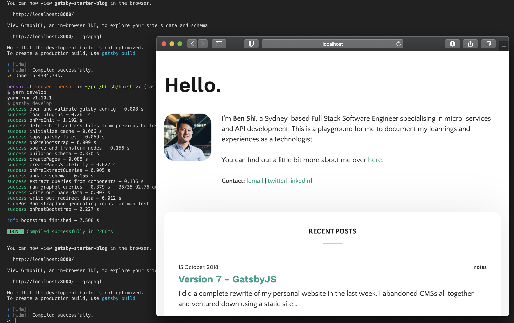

---
title: Version 7 - GatsbyJS
author: ben
type: post
date: 2018-10-15
url: /version-7-gatsbyjs/
categories:
  - notes
tags:
  - gatsbyjs
  - cms
  - wordpress
  - blog
---

I did a complete rewrite of my personal website in the last week. I abandoned CMSs all together and ventured down using a static site generator.

### Motivation
In the very beginning I had just a simple static html page with a little css. Then I started writing my own PHP to bring up dynamic content like pictures, tweets and posts but it very quickly became unmanageable. Then came [WordPress](https://wordpress.org/), it has work well for me for the past for my technology blog site (now defunct), so I decided to use it on my own personal website. I have a love/hate relationship with WordPress, while there are loads of plugins and themes out there, there are very few that met all my needs.  So I often find myself tweaking themes, trying out new plugins and modify ones that don't quite meet my needs. 

After that I did try a few other CMSs but I always find myself coming back to WordPress so I decided to self-host WordPress and wrote my own theme from scratch. I settled on simplicity for v6, only used plugins that I need ([Jetpack](https://wordpress.org/plugins/jetpack/) and [HyperCache](https://wordpress.org/plugins/hyper-cache/)) and kept the design minimal. That worked well for the past 3 years but something else was pulling me down .... WordPress. I needed a server, an application container in Nginx and every 3-4 months I had to upgrade WordPress for security patches. 

### Enter GatsbyJS
[GatsbyJS](https://www.gatsbyjs.org/) is one of the many static site generator out there. The main goal of these site generators is to remove any server side technology from the mix and serve out pre-rendered HTML with JavaScript and CSS, basically stuff that your browser is able to understand. This means huge improvement in security (less attack vector and no admin console), reliability (no dependencies like database), performances (no server rendering) and portability (I can move the website to any host that supports html).

Gatsby is written in React/GraphQL which is great. So it's pretty simple to get started for anyone with a bit of programming experience but very easy to get bogged down in it and get [JavaScript Fatigue](https://medium.com/@ericclemmons/javascript-fatigue-48d4011b6fc4). I was able to follow the [quickstart guide](https://www.gatsbyjs.org/docs/) and get started right away on a few of the [starters](https://www.gatsbyjs.org/starters/) available. Adding new features like tagging, pagination and comments does require some coding but that didn't bother me. The community behind it has been growing very quickly so you don't have to go far to get assistance. On top of that, I was impressed at how easy you can convert your site into a PWA (Progressive Web App) using [gatsby-plugin-offline](https://www.gatsbyjs.org/packages/gatsby-plugin-offline/?no-cache=1), introducing service workers so that you're able to make your website available without internet.

### Why not X?
I have tried other solutions in the past...

* [Kirby](https://getkirby.com/) is half way between a static site generator and a CMS. The contents are managed in flat-files which is great but I didn't escape the horror that is maintaining a PHP server stack (that was on version 1 of Kirby, I haven't tried version 2 yet).
* [Hugo](https://gohugo.io/) is another popular static site generator written in Go and it has a really big community built around it. It was able to compile my website really fast. However, it just didn't feel familiar enough for me especially trying to get my head around the templating language.

Obviously there are more static generators out there, it is not my intention to go through and compare them all, especially when I haven't used them in anger. 

### Conclusion
I hope this post has helped you in deciding whether you need a static site generator. In the next post I will go through in more detail how I moved from WordPress and the various problems I faced during the migration. And a subsequent post to go through my new blogging workflow.

I'm stoked that I have learned a new framework so quickly and rewrote the website from the ground up. Front-end development is not my forte so the website is not pixel perfect, feel free to drop me a message [@hbish](https://twitter.com/hbish) if you see any issues or if you want to discuss any of the above.

